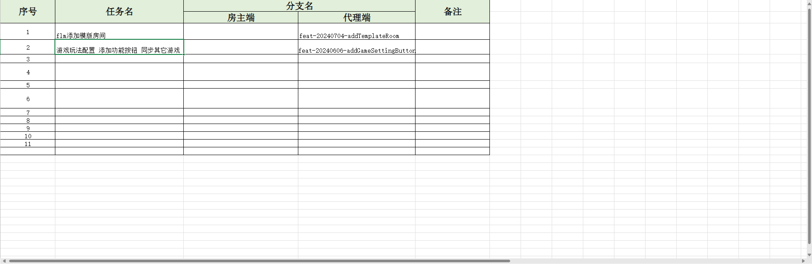
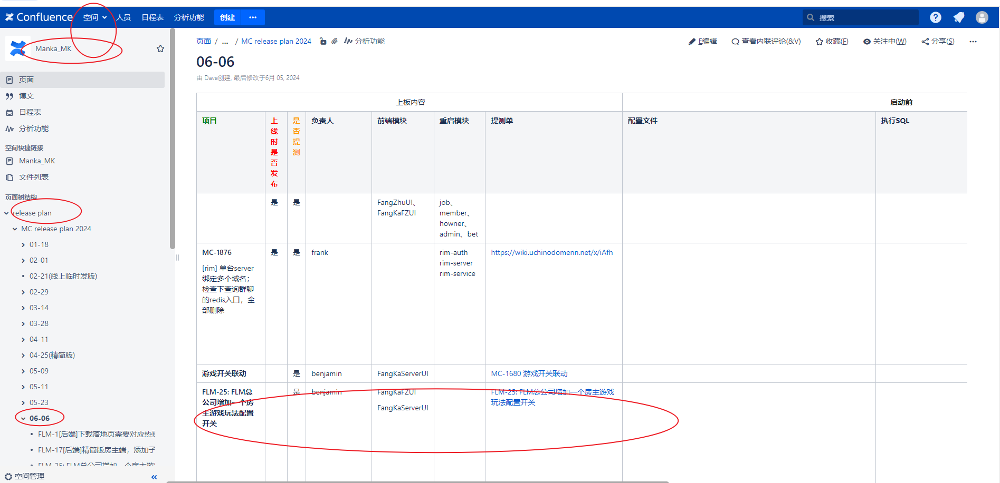
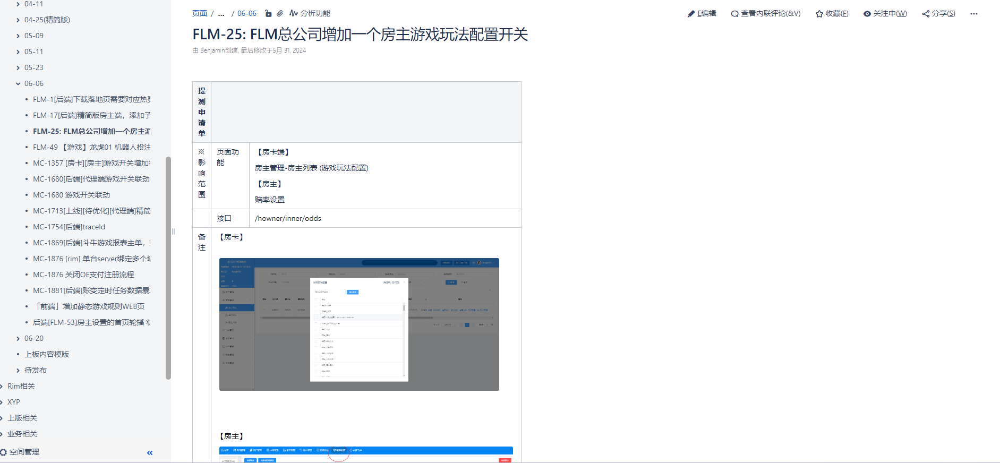

# git 技术分享

> 序言: 今天是git技术分享,抛砖引玉 主要是大家互相学习一下.
第一部分是git的工作流程,接plant单子开始,开发,自测(联调),提测,上线.
第二部分是工作中可能使用的命令,命令的简写和区别.


## git 工作流

### 1. 查看远程分支,本地分支,全部分支
```shell
git branch -a
git branch -r
git branch

```

### 1. plant分配到任务单后,一个任务单一个分支,多个任务单多个分支

```shell
// 不管什么情况下,分支一定基于master 切换到本地分支master
git checkout master
// 拉取最新的master  //分支管理 excel表格
git pull
git checkout -b feat-20240000-xxx

// 本地分支没有master
git checkout origin/master (git branch -a)
git checout -b feat-20240000-xxx
```


>前端分支名称管理
>https://mankacojp-my.sharepoint.com/:x:/r/personal/tf_shih_manka_co_jp/_layouts/15/Doc.aspx?sourcedoc=%7B82FDD630-3CDB-452E-8D32-69B83519D59C%7D&file=01-%E5%89%8D%E7%AB%AF%E5%88%86%E6%94%AF%E5%90%8D%E7%A7%B0%E7%AE%A1%E7%90%86%EF%BC%88%E6%96%B9%E4%BE%BF%E8%BF%AD%E4%BB%A3%E5%90%88%E5%B9%B6%E4%BB%A3%E7%A0%81%EF%BC%89.xlsx&action=default&mobileredirect=true


### 2. 开发过程中,一定不要合并其它人的分支,dev分支,test分支.

```shell
// 检查分支,从master开始,其它commit都是自己功能
git log --oneline
```

### 3. 自测,联调
```shell
// 1. 本地自测,本地联调 只需要切换 env 文件的,代理服务器
// 2. dev 分支自测

// 上传到远程分支,保存
git add .
git commit
git push // --set-upstream


git checout dev
git pull
git merge feat-20240000-xxx
git push 

// git pull 提示 no tracking infomation
//git branch --set-upstream-to xxx origin/xxx

// git push --set-upstream origin dev
// git push -u origin dev
// git push origin dev:dev git push origin dev
```

### 自测改bug

```shell
git checkout feat-20240000-xxx
....working...
git add .
git commit -m ''
git push // git push -u origin xxx

git checkout dev
git merge feat-20240000-xxx

```

### 3. 提测

```shell
git checkout stage
git pull
git merge feat-20240000-xxx

// 写提测单 两处地方写
// 改plant状态
// 通知测试 重新部署jenkins

```


### 4. 上线前一天

```shell

git checkout master 
git pull
git merge feat-20240000-xxx


// git tag
git tag <tagname>
git tag <tagname> commit_id 
git tag <tagname> -a xxx -m 

git tag -d <tagname>

git show <tagname>

git push origin <tagname>
git push origin -d <tagname>


```


## 可能用到的命令 commit  123123123213

```shell
// 删除本地分支
git branch -d <name>
git branch -D <name>
// 本地分支改名
git branch -m <oldname> <newname>
// 删除远程分支
git push -d origin <oldname>
// 显示关联关系
git remote show origin
git remote prune origin
git fetch -p

// add . add -A v2.0都一样
git add 
git add .
git add -A

// 清除暂存区 git add 的反向
git restore --stageed ./README.md
git restore --staged .
git restore .
// 清除工作区
git checkout .


// 提交
git commit // 默认是vim编辑器
git commit -m ''
// 撤销提交 合并commit 不会删除工作区
git reset --soft HEAD^
git reset --soft HEAD~1
git reset --soft HEAD~2
git reset --soft commit_id

git config --list
// 设置编辑器
git config --global core.editor Code
git config --global core.editor notepad++
git config --global core.editor "'E:\\Software\\Notepad++\\notepad++.exe' -multiInst -notabbar -nosession -noPlugin"
core.editor="D:\Software\notepad++\notepad++.exe" -multiInst -notabbar -nosession -noPlugin
// 设置 commit 模板
git config --global commit.template D:/commit_template
// C:\Users\Administrator\.gitconfig

// 临时储存一下 没有必要commit的时候
git stash list
git stash save xxx
git stash pop
git stash apply 
git stash drop

// 回退 一个commit
git revert
// 回退过去 时光机
git reset --hard commit_id
git log
git reflog

// master 临时一个修改bug 使用cherrypick拿到当前分支 不是同一个commit_id
git cherry-pick 


git pull git fetch --rebase 区别


git config --global alias.br branch
git br


gitk


git merge 的三个合并参数模式：
-ff 自动合并模式：当合并的分支为当前分支的后代的，那么会自动执行 --ff (Fast-forward) 模式，如果不匹配则执行 --no-ff（non-Fast-forward） 合并模式
--no-ff 非 Fast-forward 模式：在任何情况下都会创建新的 commit 进行多方合并（及时被合并的分支为自己的直接后代）
--ff-onlu Fast-forward 模式：只会按照 Fast-forward 模式进行合并，如果不符合条件（并非当前分支的直接后代），则会拒绝合并请求并且推出
以下是关于 --ff, --no-ff, --ff-only 三种模式的官方说明（使用 git merge --helo 即可查看）：
```